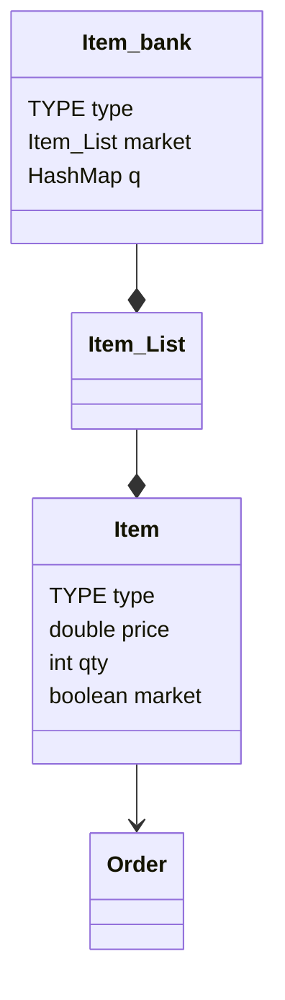

```mermaid
classDiagram
Item_bank : TYPE type
Item_bank : Item_List market
Item_bank : HashMap<Double, Item_List> q

Item_bank --* Item_List
Item_List --* Item

Item --> Order
Item : TYPE type
Item : double price
Item : int qty
Item : boolean market
```