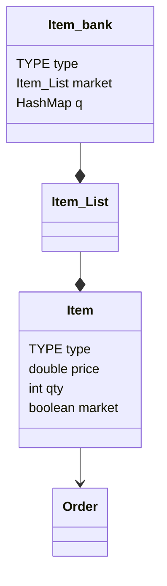

Presentation Slides: https://docs.google.com/presentation/d/1QzMx7iviBLeLkJZpkpZxpZpYfqdndcNIaZn2C6NHAAE/edit?usp=sharing
By Team 10: Elliot Phua, Benny Goh & Matthew Lalonde for Bank Of America Code To Connect 2024
